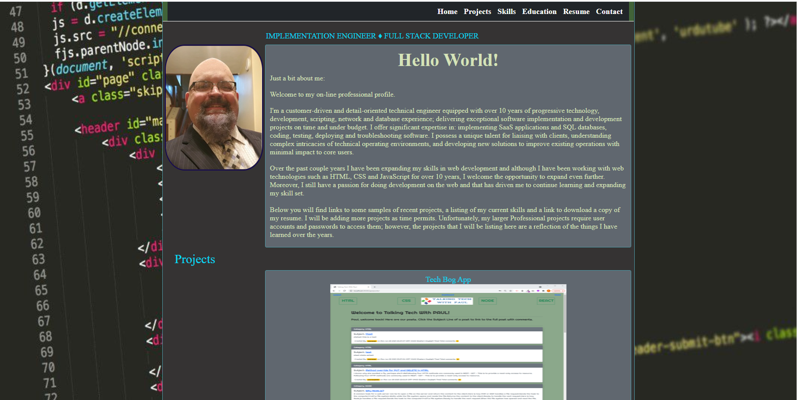

# Professional_profile

DESCRIPTION: My personal place on the web. Just a quick way for the world to learn a bit more about the person behind the technology. Professionally, it allows me to showcase some of the skills I have obtained throughout my career..... personally, it allows me to highlight some of the hobbies I enjoy.

GOAL:  
Build a professional profile page to showcase my WebDev skills, highlight a few projects and allow all those who happen to come across my profile, the opportunity to find out more about the man behind the code.

LINK: https://pmarceaujr.github.io/ProfessionalProfile_2.0/

SCREENSHOT: 
